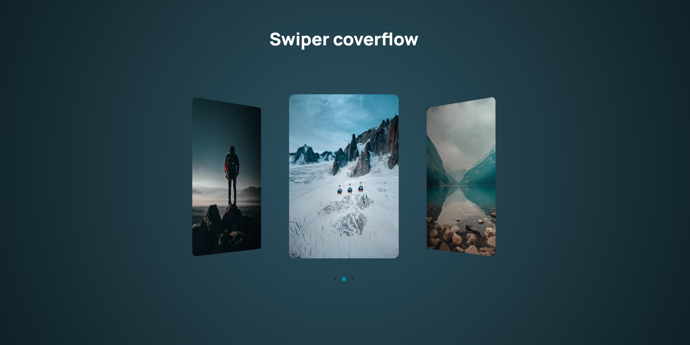

# 🎠 Swiper Coverflow

## 🌟 Project Description

An impressive slider with a **Coverflow** effect based on the [Swiper](https://swiperjs.com/) library.

## 🚀 Demo

🔗 [Swiper Coverflow Demo](https://alexgit40.github.io/SwiperCoverflow/)

## 🛠️ Technologies

- HTML5

- CSS3

- JavaScript (ES6+)

- Swiper 11

- Google Fonts (Manrope)

## 📸 Preview

## 📚 Useful Links

- [Swiper Documentation](https://swiperjs.com/swiper-api)

- [CDN to connect Swiper](https://cdn.jsdelivr.net/npm/swiper@11/swiper-bundle.min.js)
